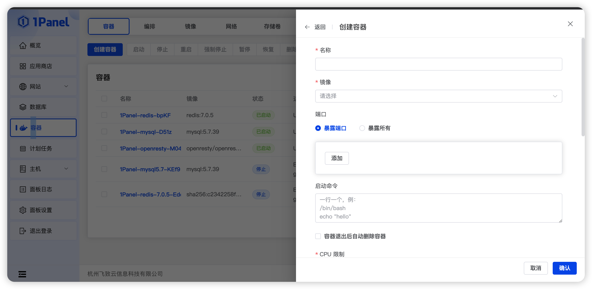
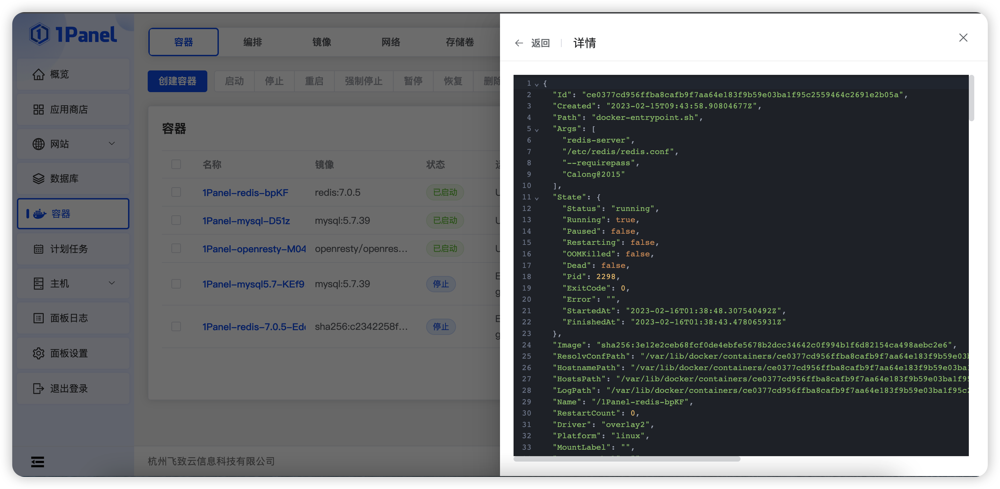
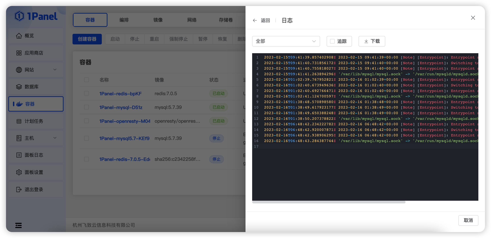
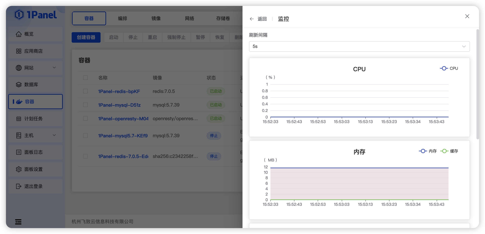

# 容器

## 1 添加容器

- 从菜单中选择 **容器**，然后单击 **创建容器**。
- **根据需要配置容器设置**。 
- 镜像需要从镜像镜像菜单手动拉取。

## 2 检查容器

点击目标容器名称，有关容器的所有信息都将显示在右侧抽屉中。

## 3 查看容器日志

- 支持查看最近一天，最近 4 小时，最近 1 小时，最近 10 分钟的容器日志。
- **追踪：** 实时刷新容器日志
- **下载：** 下载容器日志

## 4 访问容器的控制台

- 选择要授予访问权限的命令和用户，然后单击 **连接**。
- **注意：** 对于 Alpine Linux 容器，选择 /bin/ash 命令。
- 如果需要定义除提供的命令之外的命令，请将 **自定义** 选项切换为打开。

## 5 查看容器统计信息

支持查看的信息包括：

- 内存使用率
- CPU 使用率
- 磁盘 IO 使用情况
- 网络使用情况

***可以随时更改刷新间隔***。

