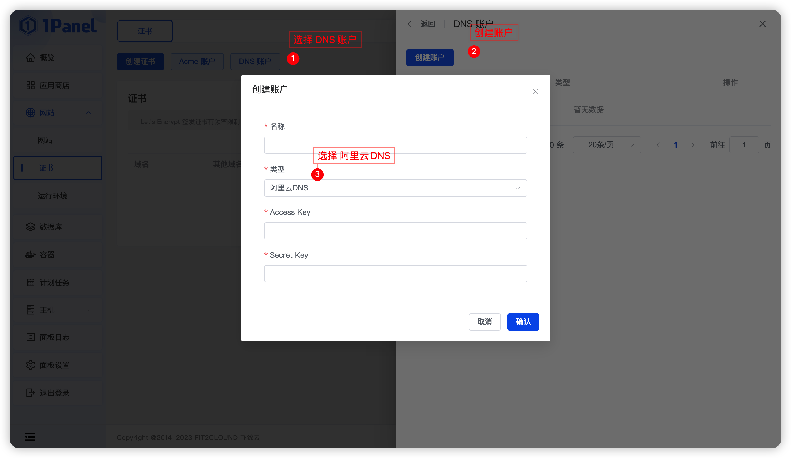
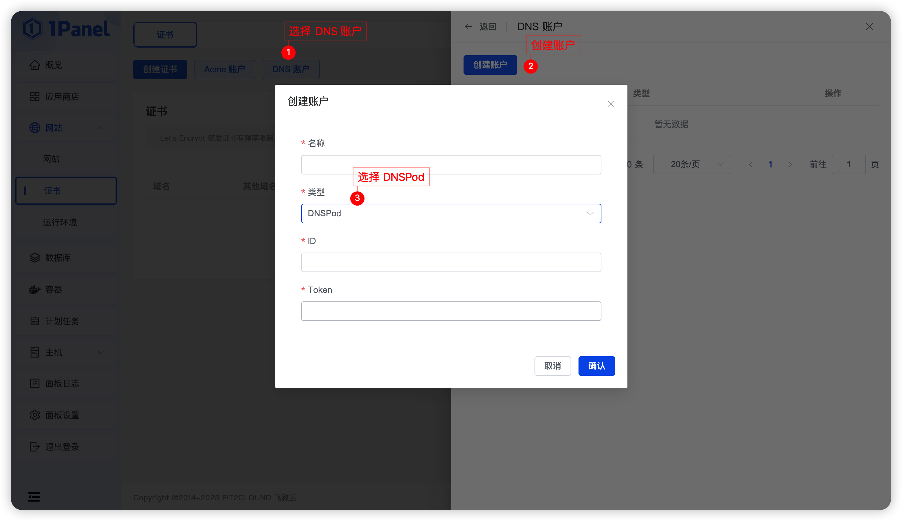
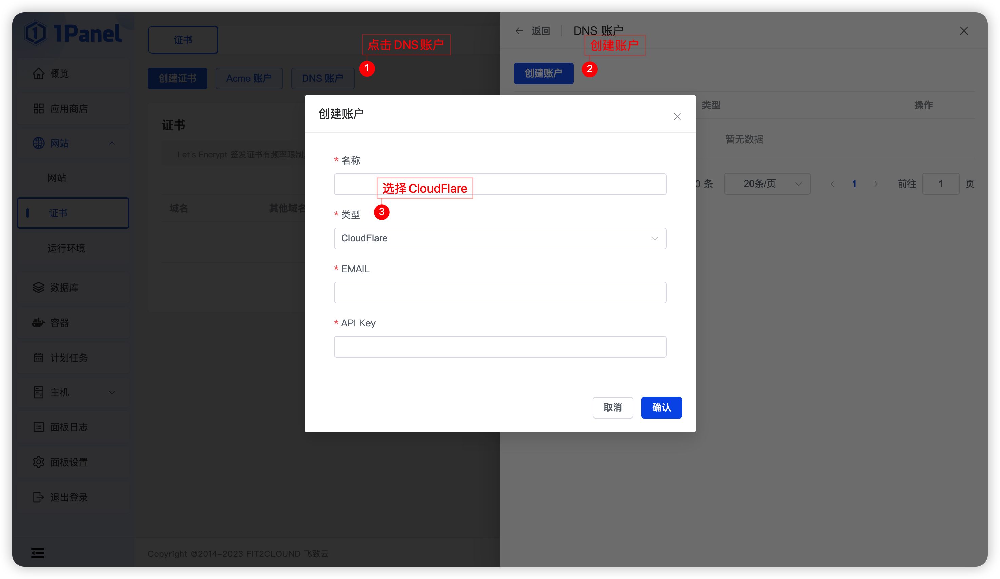

# DNS 账户

## 1 DNS 账户管理
支持 阿里云 DNS 、 DNSPod 、 CloudFlare 等类型的账户。

### 1.1 阿里云 DNS

**需要填写以下参数:**

- Access Key
- Secret Key

### 1.2 DNSPod

**需要填写以下参数:**

- ID
- Token

### 1.3 CloudFlare

**需要填写以下参数:**

- EMAIL
- API Key

